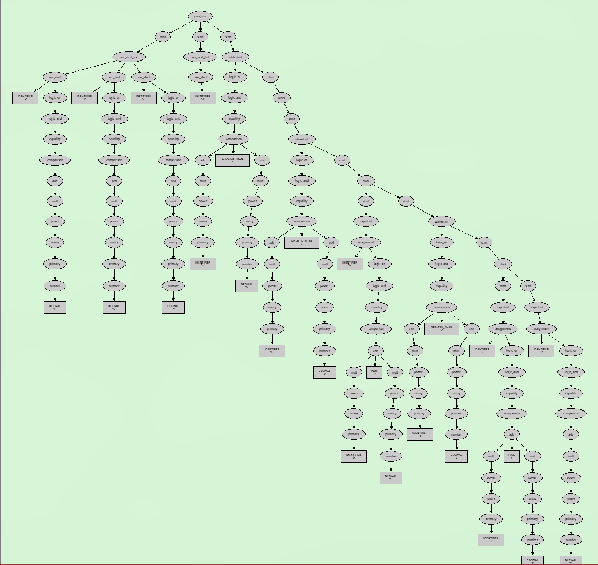
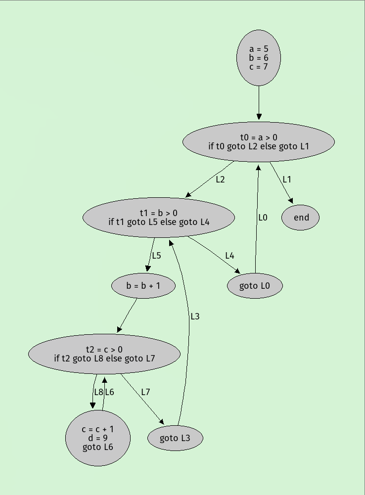
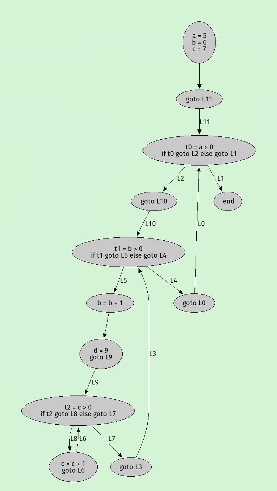
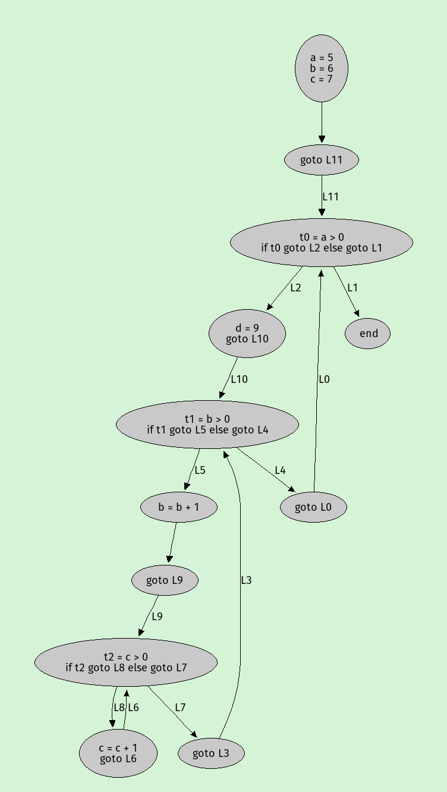
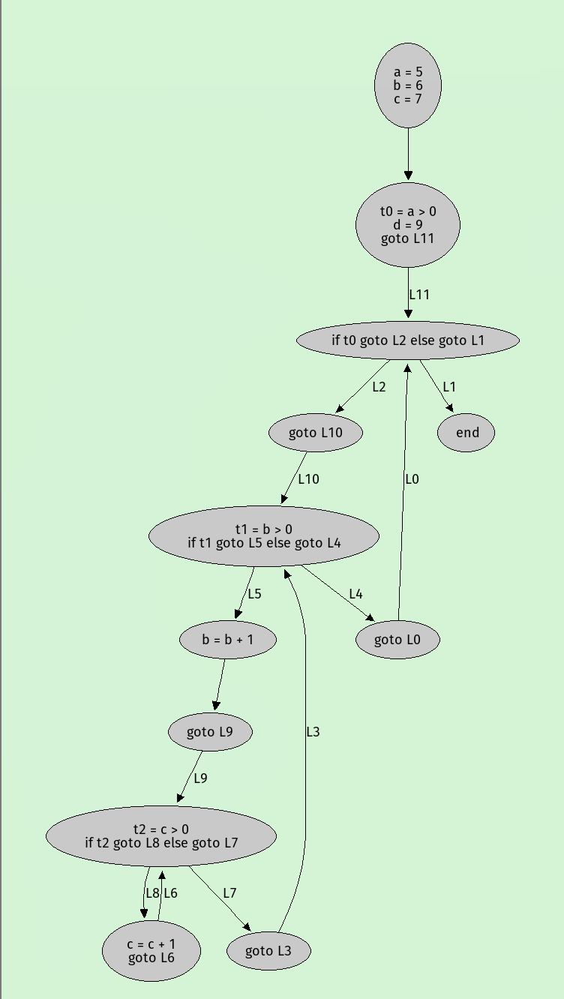
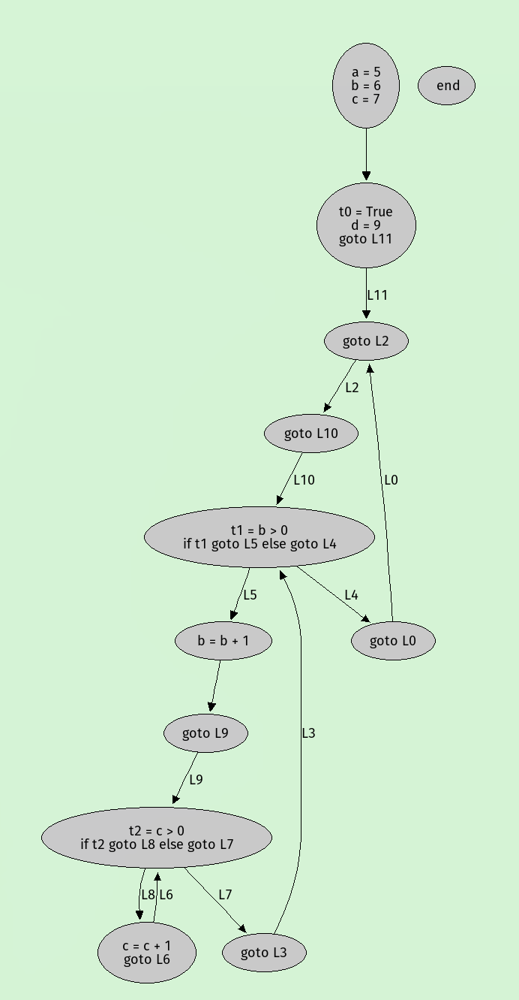
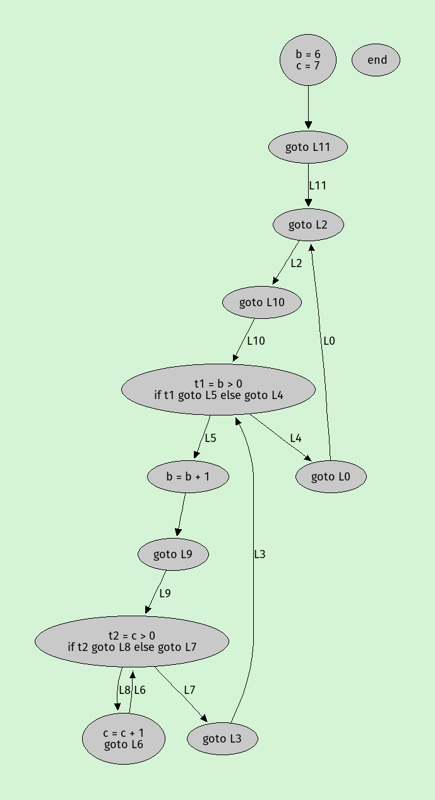
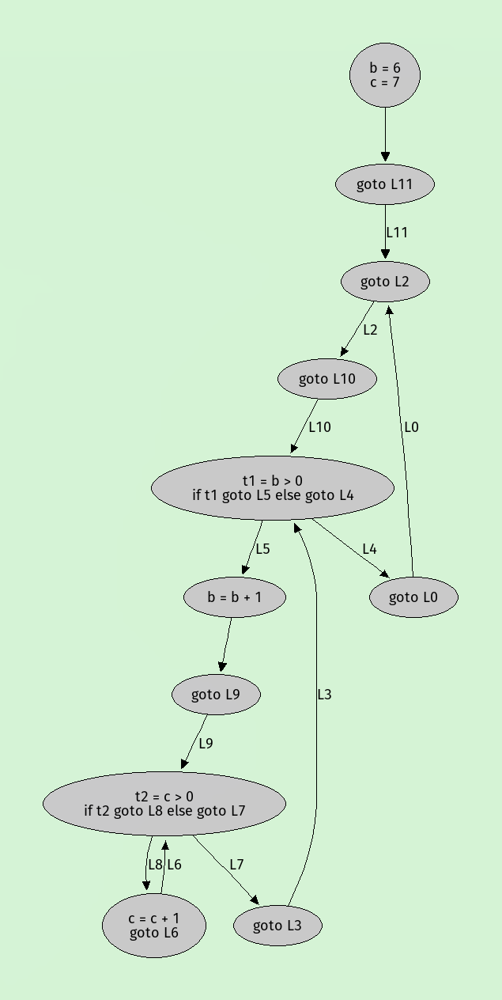

Building
========

1. Install `python`
2. Create venv, install deps, and run
```
$ python -m venv .venv
$ source ./.venv/bin/activate
$ pip install -r requirements.txt
$ python src/core/simpleast.py src/core/test/expression.kool
```

# Example
Optimization pipeline for the following code snippet is shown below:
```
var a = 5, b = 6, c = 7
var d
while a > 0 {
    while b > 0 {
        b = b + 1
        while c > 0 {
            c = c + 1
            d = 9
        }
    }
}
```
## 1. Syntax Tree

## 2. Basic blocks

## 3. Loop Invariant Code Motion



## 4. Common Subexpression Elimination

## 5. Copy Propagation

## 6. Constant Folding

## 7. Dead Code Elimination


